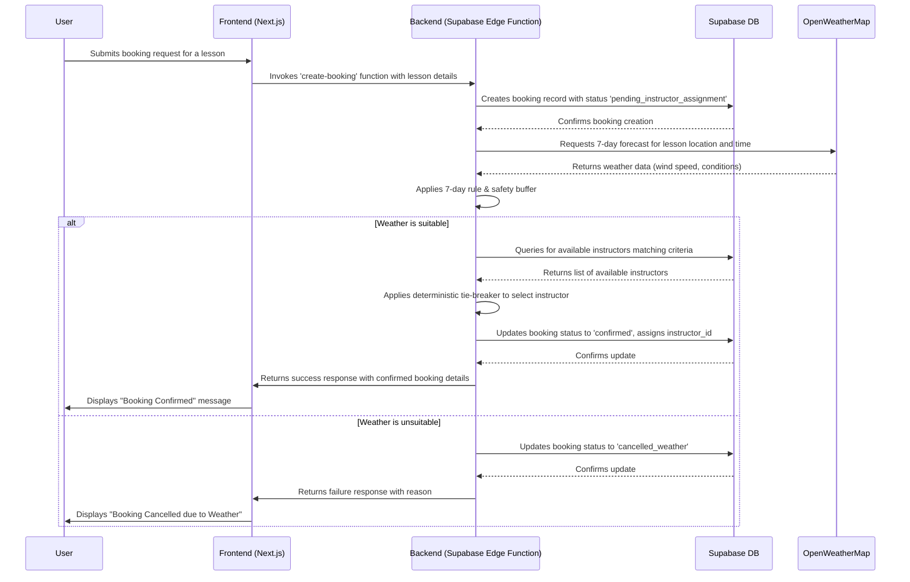

# Architecture Document: KiteOps

**Author:** Winston (Architect) & BIP (Project Lead)
**Date:** 2025-12-02
**Version:** 1.0

## 1. Executive Summary

The architecture for the KiteOps project is designed as a modern, scalable, and performant web application. It leverages a Jamstack-inspired approach with a **Next.js** frontend deployed on **Vercel**. The backend is a comprehensive suite of services provided by **Supabase**, including a PostgreSQL database, user authentication, real-time updates, and serverless Edge Functions. This design prioritizes developer efficiency, rapid feature delivery, and robustness. The system's core innovation, the **"Intelligent Scheduling Engine,"** is implemented as a serverless function, ensuring complex scheduling logic is handled efficiently. A strong emphasis is placed on consistency and maintainability through detailed implementation patterns and a comprehensive, layered testing strategy.

## 2. Project Initialization

The project will be initialized using the official Next.js starter template, `create-next-app`. This choice aligns with the PRD's specified framework (Next.js 14+ with App Router) and the UX design's use of Tailwind CSS. (Verification: [Official Documentation](https://nextjs.org/docs/api-reference/create-next-app))

The full initialization command, which should be the **first implementation story** for the development team, will be:

```bash
npx create-next-app@latest kiteops-app --typescript --tailwind --eslint
```

The following architectural decisions are **PROVIDED BY STARTER**, ensuring consistency from the outset:
*   **Language/Framework:** Next.js with TypeScript
*   **Styling Solution:** Tailwind CSS
*   **Linting/Formatting:** ESLint
*   **Build Tooling:** Integrated Next.js build system (Webpack/Turbopack)
*   **Project Structure:** Standard Next.js App Router project layout

## 3. Architecture Decision Summary

| Category | Decision | Version | Rationale |
| :--- | :--- | :--- | :--- |
| **Data Persistence** | Supabase (PostgreSQL) | 15.x | Integrated backend services accelerate development and simplify architecture. |
| **Backend API** | Supabase Edge Functions | 2.86.0 (Client) | Tightly integrated, scalable, and performant solution for custom business logic. |
| **Real-time** | Supabase Realtime | 2.86.0 (Client) | Seamless integration for live updates, essential for notifications and calendars. |
| **Background Jobs** | Supabase DB Functions w/ pg_cron | 1.6.4 | Centralizes background processing within the database, minimizing complexity. |
| **Deployment Target** | Vercel | N/A (Platform) | Optimized, high-performance, and scalable hosting specifically for Next.js. |
| **Authentication** | Supabase Auth | 2.86.0 (Client) | Robust, secure, and integrated solution with native support for Row Level Security. |
| **Email Provider** | Resend | 6.5.2 | Modern, developer-friendly API with a strong focus on deliverability. |
| **SMS Provider** | Twilio | 5.10.6 | Industry-leading reliability and global coverage for critical SMS alerts. |
| **Data Modeling** | Refined PostgreSQL Schema | N/A | A robust, normalized schema collaboratively designed for all project requirements. |
| **Error Handling** | Layered Strategy | N/A | Ensures a resilient application, clear user experience, and efficient debugging. |
| **Logging** | Structured, Centralized Logging | N/A | Provides comprehensive visibility into application health, security, and performance. |
| **External APIs** | Cache-first (OpenWeatherMap) | v3.0 | A resilient, testable, and efficient strategy for integrating external weather data. |
| **State Management** | TanStack Query (Server) / Context (Client) | 5.90.11 | Hybrid approach using best-in-class tools for server and client state. |
| **File Storage** | Supabase Storage | 2.86.0 (Client) | Integrated with the Supabase ecosystem for simplicity and unified billing. |

## 4. Technology Stack Details

*   **Frontend Framework:** Next.js `16.0.6` (with App Router)
*   **Language:** TypeScript `5.9.3`
*   **Styling:** Tailwind CSS `4.1.17` with `shadcn/ui` `0.8.0` (CLI)
*   **Backend Platform:** Supabase
    *   **Database:** PostgreSQL `15.x`
    *   **Authentication:** Supabase Auth (via Client `2.86.0`)
    *   **Serverless Functions:** Supabase Edge Functions (via Client `2.86.0`)
    *   **Real-time:** Supabase Realtime (via Client `2.86.0`)
    *   **Storage:** Supabase Storage (via Client `2.86.0`)
    *   **Scheduled Jobs:** `pg_cron` `1.6.4`
*   **Deployment:** Vercel Platform
*   **Frontend State Management:** TanStack Query `5.90.11` (for Server State), React Context/Hooks (for Client State)
*   **Notification Services:**
    *   **Email:** Resend `6.5.2`
    *   **SMS:** Twilio `5.10.6`
*   **External Data:** OpenWeatherMap API `v3.0`

### 4.1. Version Justification

All specified versions represent the most recent, stable releases as of **December 2, 2025**. The strategy is to use the latest stable versions to leverage modern features and security enhancements, rather than targeting LTS (Long-Term Support) versions, as rapid development and access to the newest capabilities are prioritized for this project. Should post-launch stability become a higher priority than feature velocity, a shift to an LTS-focused strategy will be considered. The `+` notation has been removed in favor of exact versions to ensure a reproducible environment.

## 5. Complete Project Structure

```
kiteops-app/
├── app/                  # Main application routes (what users see)
│   ├── (auth)/           # Route group for Login, Signup pages
│   ├── (protected)/      # Route group for pages requiring login
│   │   ├── dashboard/    # The main dashboards for each user role
│   │   ├── calendar/     # The calendar views for instructors/managers
│   │   └── settings/     # User profile and settings pages
│   ├── api/              # API routes, if needed for simple server tasks
│   ├── layout.tsx        # The main page layout
│   └── page.tsx          # The public landing page
│
├── components/           # Reusable UI components (buttons, forms, etc.)
│   ├── ui/               # Core UI elements from our design system
│   ├── calendar/         # Calendar-specific components
│   └── dashboard/        # Dashboard-specific components
│
├── lib/                  # Shared utilities, helpers, and core logic
│   ├── actions.ts        # Server-side logic (e.g., form submissions)
│   ├── db.ts             # Supabase client setup and configuration
│   └── types.ts          # TypeScript type definitions
│
├── public/               # Static assets (images, icons, fonts)
│
├── supabase/             # All Supabase-specific files
│   ├── functions/        # Code for our Edge Functions
│   │   ├── scheduling-engine/ # The intelligent scheduling logic
│   │   └── weather-poller/    # Logic for fetching weather data
│   └── migrations/       # Database schema changes and history
│
└── tests/                # Our unit, integration, and E2E tests
```

## 6. Data Architecture

The data model is a normalized PostgreSQL schema designed for Supabase. It is centered around the `auth.users` table and a custom `profiles` table to manage roles and user-specific data. Key tables include `profiles`, `lessons`, `bookings`, `availability`, `instructor_details`, `customer_details`, and a many-to-many link table `instructor_lesson_types`. The full, detailed schema has been defined and approved during our collaborative session.

## 7. Novel Pattern: Intelligent Scheduling Engine

The design for the "KiteOps Intelligent Scheduling Engine" has been fully documented, including:
*   A **critical precept for School Time Zone Awareness** in all calculations.
*   A **7-day rule** to skip weather checks on unreliable long-range forecasts.
*   A detailed **deterministic tie-breaker** algorithm for load balancing.
*   A configurable **"Safety Buffer Window"** for the "Automatic Wind Adaptation" flow.
*   The use of a `status_reason` field in the `bookings` table for contextual updates.

This comprehensive design ensures the engine is robust, predictable, and aligned with real-world operational needs.

### 7.1. Component Interaction and Data Flow

To clarify the engine's operation, this section details the data flow and state transitions.

**State Definitions:**

The `bookings` table `status` field will manage the lifecycle of a lesson booking. Key states include:
*   `pending_weather_check`: A new booking has been created but is more than 7 days away. No weather data is available yet.
*   `pending_instructor_assignment`: Within the 7-day window; the engine is actively seeking a suitable instructor based on weather and availability.
*   `confirmed`: An instructor has been assigned, and the lesson is confirmed. Notifications have been sent.
*   `cancelled_weather`: The booking was automatically cancelled due to adverse weather forecasts (e.g., no wind, too much wind).
*   `cancelled_user`: The booking was cancelled by the customer or manager.
*   `completed`: The lesson has successfully occurred.

**Sequence Diagram (Text-based):**

This diagram illustrates the "Happy Path" for automatic scheduling when a user books a lesson within the 7-day forecast window.



## 8. Implementation Patterns & Consistency Rules

*   **Naming:** `kebab-case` for API routes, `snake_case` for database objects, `PascalCase` for React components.
*   **Structure:** Feature-based component organization and co-located test files.
*   **API Format:** `data` wrapper for success, standardized error shape, and optional `meta` field.
*   **Date/Time:** UTC storage is mandatory, with all logic performed in the school's local time zone.
*   **Testing:** A layered strategy of Unit, Integration, and End-to-End tests, with a focus on critical paths like scheduling and auth.

## 9. Integration Points

*   **Frontend to Backend:** Communication will be handled via the **Supabase JS Client** for data operations and invoking **Edge Functions**.
*   **Backend to External:** **Edge Functions** or **Database Functions** will communicate with **OpenWeatherMap**, **Resend**, and **Twilio**.
*   **Real-time:** The frontend will subscribe to database changes via **Supabase Realtime** for live UI updates.

## 10. Security & Performance

*   **Security:** Handled by **Supabase Auth**, with fine-grained access control implemented via **PostgreSQL Row Level Security (RLS)** based on the user's role in the `profiles` table.
*   **Performance:** Addressed by the **Vercel Edge Network** for fast content delivery, and **TanStack Query** on the frontend for intelligent data caching and reduction of API requests.

---

_Generated by BMAD Decision Architecture Workflow v1.0_
_Date: 2025-12-02_
_For: BIP_