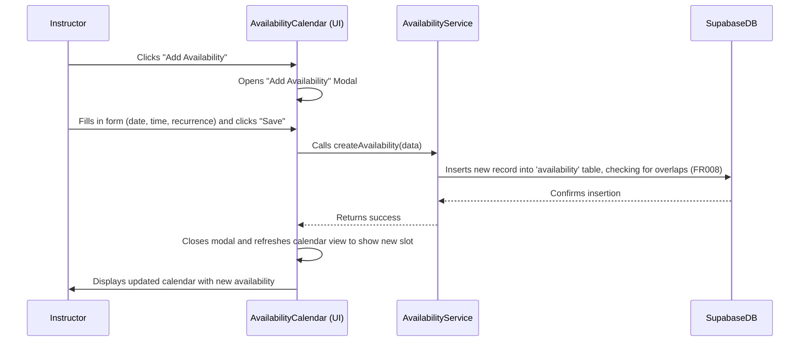

# Epic Technical Specification: Foundation, Authentication, and Instructor Profiles

Date: 2025-12-02
Author: BIP
Epic ID: 1
Status: Draft

---

## Overview

This technical specification details Epic 1: "Foundation, Authentication, and Instructor Profiles" for the KiteOps project. This epic establishes the fundamental technical infrastructure, implements core user authentication mechanisms, and enables instructors to manage their professional profiles and availability. It lays the groundwork for subsequent epics by providing the essential building blocks for user interaction, data persistence, and UI consistency, directly supporting the PRD's goals of streamlining operations and improving user experience.

## Objectives and Scope

### Objectives

*   Establish the core technical foundation using Next.js, Supabase, and a consistent UI component library.
*   Implement robust user registration (FR002) and login (FR003) with email verification.
*   Implement role-based access control (FR001) to secure application routes and data.
*   Enable instructors to create and manage their professional profiles (FR016), including certifications and lesson types.
*   Provide instructors with an interactive calendar to manage their availability (FR018, FR019, FR020, FR021) and prevent overlapping entries (FR008).

### In-Scope

*   Next.js project initialization and basic CI/CD setup.
*   Supabase project setup and initial database schema (profiles, lessons, bookings, availability, instructor_details, customer_details tables).
*   Integration of `shadcn/ui` and definition of custom UI components (Lesson Card).
*   User registration and login for Instructor and Manager roles.
*   Email verification for new user registrations.
*   Role-based access control middleware and Supabase Row Level Security (RLS).
*   Instructor profile management page.
*   Instructor calendar for availability management, including adding/modifying/removing availability and blocking personal time.
*   Validation to prevent overlapping availability slots for instructors.

### Out-of-Scope

*   Public-facing marketing pages (Home, About, Pricing).
*   Full payment integration.
*   Advanced AI scheduling optimizations beyond initial rule-based engine.
*   Manager-specific profile or availability management.
*   Customer-specific profile management.
*   Detailed DevOps practices beyond basic CI.

## System Architecture Alignment

Epic 1 is foundational and directly aligns with the core architectural decisions outlined in `architecture.md`. The implementation will utilize:

*   **Next.js (Frontend):** For the application shell, routing, and server-side rendering, as specified in PRD and Architecture.
*   **Supabase (Backend):** The entire backend infrastructure for user authentication (Supabase Auth), database (PostgreSQL 15.x), and schema management will be based on Supabase. Row Level Security (RLS) is a critical alignment for FR001.
*   **Tailwind CSS & shadcn/ui:** For consistent and efficient UI development, as defined in `ux-design-specification.md` and `architecture.md`.
*   **TypeScript:** Ensuring type safety and maintainability across the codebase.
*   **Vercel:** For deployment of the Next.js frontend, integrated with the CI/CD pipeline.
*   **Resend:** For handling email verification, as part of FR002.

This epic establishes the foundational layers and critical cross-cutting concerns (authentication, authorization, UI framework) upon which all subsequent epics will build.

## Detailed Design

### Services and Modules

| Service/Module | Responsibilities | Inputs/Outputs | Owner/Epic |
| :--- | :--- | :--- | :--- |
| **AuthService** | Handles user registration, login, session management, and password resets using Supabase Auth. | Inputs: User credentials. Outputs: User session/JWT. | Epic 1 |
| **ProfileService** | Manages CRUD operations for instructor profiles (`instructor_details` table). | Inputs: Profile data. Outputs: Updated profile. | Epic 1 |
| **AvailabilityService**| Manages CRUD operations for instructor availability, including creating recurring slots and preventing overlaps (FR008). | Inputs: Availability data. Outputs: Created/updated availability slots. | Epic 1 |
| **NotificationService**| (Stub in this epic) Handles sending transactional emails. Its first use is sending the verification email (FR002) via Resend. | Inputs: Recipient, message type. Outputs: Delivery status. | Epic 4 (core), used in Epic 1 |
| **RBAC Middleware** | A Next.js middleware that intercepts requests to protected routes, validates the user's role from their session, and redirects if unauthorized. | Inputs: User session. Outputs: Continue or redirect. | Epic 1 |

### Data Models and Contracts

The following data models are central to Epic 1. All tables will have Row Level Security (RLS) enabled with default-deny policies, as specified in `architecture.md`.

**`profiles` Table**
*   Purpose: Stores role-based information linked to the primary `auth.users` table.
*   Schema:
    *   `id` (UUID, Primary Key, FK to `auth.users.id`)
    *   `role` (TEXT, e.g., 'instructor', 'manager')
    *   `created_at` (TIMESTAMPTZ)

**`instructor_details` Table**
*   Purpose: Stores professional information specific to instructors.
*   Schema:
    *   `user_id` (UUID, Primary Key, FK to `profiles.id`)
    *   `certifications` (TEXT[])
    *   `lesson_types` (TEXT[])
    *   `updated_at` (TIMESTAMPTZ)

**`availability` Table**
*   Purpose: Stores when an instructor is available to teach.
*   Schema:
    *   `id` (BIGSERIAL, Primary Key)
    *   `instructor_id` (UUID, FK to `profiles.id`)
    *   `start_time` (TIMESTAMPTZ)
    *   `end_time` (TIMESTAMPTZ)
    *   `recurrence_rule` (TEXT, e.g., iCal RRULE string for weekly/bi-weekly recurrence)

### APIs and Interfaces

As the project uses the Supabase JS Client, direct interaction with the database will be favored over custom REST endpoints for core CRUD. Key client-side "API" calls will be:

**Authentication:**
*   **User Registration:** `supabase.auth.signUp({ email, password, options: { data: { role: 'instructor' } } })`
*   **User Login:** `supabase.auth.signInWithPassword({ email, password })`

**Data Management (via `lib/db.ts` client):**
*   **Update Instructor Profile:** `supabase.from('instructor_details').update({ certifications: [...] }).eq('user_id', userId)`
*   **Create Availability:** `supabase.from('availability').insert([{ instructor_id, start_time, end_time }])`
*   **Fetch Availability:** `supabase.from('availability').select('*').eq('instructor_id', userId)`

No custom API routes in the `app/api/` directory are required for this epic.

### Workflows and Sequencing

**User Registration Workflow:**
1.  **Trigger:** User submits the "Sign Up" form on the frontend.
2.  **Action:** The frontend calls the `AuthService.register()` function, which executes `supabase.auth.signUp`.
3.  **Backend:** Supabase Auth creates the user in `auth.users` and a corresponding entry in `public.profiles`. A database trigger or function then calls the `NotificationService`.
4.  **Notification:** The `NotificationService` sends a verification email using Resend.
5.  **Feedback:** The user is redirected to a page instructing them to check their email for a verification link.

**Instructor Sets Availability Workflow (Text-based Sequence):**

## Non-Functional Requirements

### Performance

*   **NFR01:** All user-facing pages and dashboards shall load in under 3 seconds. Critical actions, such as user login or updating availability, shall be confirmed to the user in under 2 seconds.
*   **Implementation:** This will be achieved through Vercel's Edge Network for fast content delivery and TanStack Query on the frontend for intelligent data caching, which reduces API requests for session and profile data.

### Security

*   **NFR03:** All user data must be encrypted in transit (TLS 1.2+) and at rest. The system must adhere to best practices for authentication and authorization.
*   **Implementation:**
    *   **Authentication:** Handled by Supabase Auth, which provides secure, JWT-based session management.
    *   **Authorization:** Implemented via PostgreSQL Row Level Security (RLS) based on the user's role in the `profiles` table. This directly addresses FR001 and ensures users can only access data they are permitted to see.
    *   **Data Handling:** Passwords are automatically hashed by Supabase Auth. Sensitive data in transit is encrypted by default by Supabase's client libraries.

### Reliability/Availability

*   **NFR05:** The core system shall have an uptime of 99.9%. For Epic 1, this is primarily dependent on the uptime of Supabase Auth and Database services.
*   **Implementation:** We will rely on the Service Level Agreement (SLA) provided by Supabase for its core services. No custom reliability mechanisms are in scope for this epic.

### Observability

*   **Logging:** All authentication events (successful logins, failed attempts, registrations) generated by Supabase Auth will be captured and forwarded to a centralized logging system.
*   **Metrics:** Key metrics for this epic include user registration counts and login rates.
*   **Tracing:** Not applicable for this epic. The focus is on capturing critical security and access logs.

## Dependencies and Integrations

The implementation of Epic 1 relies on the following key dependencies and external service integrations, as specified in the `architecture.md` document. Versions are pinned to ensure a reproducible environment.

### Core Dependencies

| Dependency | Version | Purpose |
| :--- | :--- | :--- |
| Next.js | `16.0.6` | Frontend framework, routing, and rendering. |
| TypeScript | `5.9.3` | Language for type safety and maintainability. |
| Tailwind CSS | `4.1.17` | CSS framework for styling. |
| shadcn/ui | `0.8.0` | UI component library. |
| Supabase Client | `2.86.0` | Primary SDK for interacting with the Supabase backend. |
| TanStack Query | `5.90.11` | Server state management, caching, and data fetching. |
| Resend | `6.5.2` | SDK for sending transactional emails (e.g., email verification). |

### External Service Integrations

| Service | Purpose | Integration Point |
| :--- | :--- | :--- |
| **Supabase** | Backend-as-a-Service | The entire application is built on Supabase, using its Auth, Database (PostgreSQL), and Realtime services. All data management for profiles and availability occurs via the Supabase client. |
| **Vercel** | Deployment & Hosting | The Next.js application will be deployed to Vercel, which is configured to build and serve the application. |
| **Resend** | Transactional Email | Integrated via the `NotificationService` to send the user registration verification email (FR002). |

## Acceptance Criteria (Authoritative)

The following acceptance criteria are derived directly from the user stories defined for Epic 1 in `epics.md`, ensuring all requirements are atomic and testable.

### Story 1.1: Initialize Next.js Project and Setup CI/CD
*   **AC1.1.1:** The root directory contains a new subdirectory named `app`, which is initialized as a Next.js application with TypeScript, Tailwind CSS, and ESLint configured.
*   **AC1.1.2:** The project is connected to a Vercel account for automated deployments.
*   **AC1.1.3:** A basic CI pipeline is configured to run linting and tests on every push to the main branch.

### Story 1.2: Setup Supabase Backend and Schema
*   **AC1.2.1:** The `profiles`, `lessons`, `bookings`, `availability`, `instructor_details`, and `customer_details` tables are created as per the data model in `architecture.md`.
*   **AC1.2.2:** Row Level Security (RLS) is enabled on all tables with default-deny policies.
*   **AC1.2.3:** The Supabase client is configured in the Next.js application in `lib/db.ts`.

### Story 1.3: Implement Core UI Component Library
*   **AC1.3.1:** The core `shadcn/ui` components (Button, Input, Card, Modal) are configured.
*   **AC1.3.2:** The color palette, typography, and spacing from `ux-design-specification.md` are configured as Tailwind CSS theme variables.
*   **AC1.3.3:** The custom `Lesson Card` component is created and available for use.

### Story 1.4: User Registration and Email Verification (FR002)
*   **AC1.4.1:** A new user is created in Supabase `auth.users` table upon form submission.
*   **AC1.4.2:** A corresponding entry is created in the `profiles` table with the selected role.
*   **AC1.4.3:** The system sends a verification email to the user's email address via Resend.
*   **AC1.4.4:** The user is redirected to a page instructing them to check their email for a verification link.

### Story 1.5: User Login and Session Management (FR003)
*   **AC1.5.1:** Upon successful login, the user's session is authenticated and they are redirected to their role-specific dashboard.
*   **AC1.5.2:** The user's session is maintained across browser refreshes.
*   **AC1.5.3:** Incorrect login attempts display a clear error message to the user.

### Story 1.6: Implement Role-Based Access Control (RBAC) (FR001)
*   **AC1.6.1:** When an unauthorized user attempts to access a protected route, they are redirected away from the page (e.g., to their own dashboard or a "Not Authorized" page).
*   **AC1.6.2:** Supabase RLS policies prevent unauthorized data access based on the user's role in the `profiles` table for all relevant tables.

### Story 1.7: Instructor Profile Management (FR016)
*   **AC1.7.1:** When an instructor updates their profile information on the settings page, the changes are persisted to the `instructor_details` table.
*   **AC1.7.2:** A success notification is displayed to the instructor upon successful save.

### Story 1.8: Instructor Availability Management (FR018, FR019, FR020, FR021, FR008)
*   **AC1.8.1:** New availability entries are created in the `availability` table upon submission from the calendar UI.
*   **AC1.8.2:** The calendar view updates immediately to show the new availability slots, styled as per the UX spec.
*   **AC1.8.3:** The system prevents the creation of overlapping availability slots for the same instructor (FR008), providing an error message if an overlap is attempted.

## Traceability Mapping

This table maps the Acceptance Criteria (ACs) to their corresponding Functional Requirements (FRs) and the primary components or APIs involved in their implementation.

| Acceptance Criteria | Functional Requirement(s) | Spec Section(s) | Component(s)/API(s) | Test Idea |
| :------------------ | :------------------------ | :-------------- | :------------------ | :-------- |
| AC1.1.1             | N/A                       | Architecture (2), UX (2.1) | Next.js CLI, Vercel | Verify `app` subdirectory exists and contains project structure/dependencies. |
| AC1.1.2             | N/A                       | Architecture (3) | Vercel | Confirm Vercel deployment of a simple page. |
| AC1.1.3             | N/A                       | N/A                       | GitHub Actions/Vercel | Push to main branch, verify CI runs lint/tests. |
| AC1.2.1             | N/A                       | Architecture (6)          | Supabase CLI/SQL    | Inspect Supabase database for table schemas. |
| AC1.2.2             | N/A                       | Architecture (10)         | Supabase RLS        | Attempt unauthorized data access to tables. |
| AC1.2.3             | N/A                       | Architecture (6)          | Supabase JS Client  | Verify successful Supabase client initialization. |
| AC1.3.1             | N/A                       | UX (2.1, 5.1)             | shadcn/ui           | Render core components, verify default styling. |
| AC1.3.2             | N/A                       | UX (2.2, 2.3, 2.4)        | Tailwind CSS        | Verify color/typography/spacing in browser dev tools. |
| AC1.3.3             | N/A                       | UX (5.2.1)                | React Component     | Render Lesson Card with dummy data, inspect structure. |
| AC1.4.1, AC1.4.2    | FR002                     | Architecture (3)          | Supabase Auth       | Register new user, verify entries in `auth.users` & `public.profiles`. |
| AC1.4.3             | FR002                     | Architecture (3)          | Resend API          | Check email logs for verification email send. |
| AC1.4.4             | FR002                     | N/A                       | Next.js Frontend    | Verify redirect to "check email" page. |
| AC1.5.1, AC1.5.2    | FR003                     | Architecture (3)          | Supabase Auth       | Login, verify redirect and session persistence. |
| AC1.5.3             | FR003                     | N/A                       | Next.js Frontend    | Attempt login with bad credentials, verify error message. |
| AC1.6.1             | FR001                     | Architecture (10)         | Next.js Middleware  | Attempt access to protected routes as unauthorized user. |
| AC1.6.2             | FR001                     | Architecture (10)         | Supabase RLS        | Attempt unauthorized data query through API/client. |
| AC1.7.1             | FR016                     | Architecture (6)          | Supabase JS Client  | Update profile, verify database changes. |
| AC1.7.2             | N/A                       | UX (6.2)                  | UI Component        | Verify success notification display. |
| AC1.8.1             | FR019, FR020, FR021       | Architecture (6)          | Supabase JS Client  | Add availability, verify database insertion. |
| AC1.8.2             | FR018                     | UX (5.2.2)                | React Component     | Add availability, verify calendar UI update. |
| AC1.8.3             | FR008                     | N/A                       | Supabase Trigger/RLS | Attempt to create overlapping availability, verify rejection/error. |

## Risks, Assumptions, Open Questions

*   **Risk:** There is a moderate risk of vendor lock-in with Supabase. While it significantly accelerates initial development, migrating to a different backend provider in the future would require a substantial engineering effort.
    *   **Mitigation:** Abstract all Supabase-specific client calls into dedicated services/repositories to contain the blast radius of change. Adhere to standard PostgreSQL practices in all custom SQL.
*   **Assumption:** The free/pro tiers of Supabase, Vercel, and Resend will be sufficient for the initial launch and can scale cost-effectively with user growth.
*   **Question:** What are the specific recurrence rules required for instructor availability (FR019)? (e.g., weekly, bi-weekly, every Monday/Tuesday). This needs clarification before implementation.
*   **Question:** What are the data types and potential values for instructor `certifications` (FR016)? Is this a predefined list or free text?

## Test Strategy Summary

The test strategy for Epic 1 will focus on ensuring the foundational components are robust and reliable. A layered approach will be used, covering all Acceptance Criteria.

*   **Unit Tests:**
    *   Services (e.g., `AvailabilityService`) will be unit-tested to validate business logic, such as overlap detection.
    *   UI Components (e.g., `AvailabilityCalendar`) will be tested in isolation using a tool like Storybook to verify states and props.
*   **Integration Tests:**
    *   Tests will verify the integration between the Next.js frontend and the Supabase backend.
    *   A key integration test will cover the user registration flow, ensuring a UI form submission correctly creates a user in `auth.users` and a profile in `public.profiles`.
*   **End-to-End (E2E) Tests:**
    *   A critical path E2E test will simulate the full instructor onboarding flow:
        1.  User registers for a new instructor account.
        2.  User verifies their email.
        3.  User logs in and is redirected to the dashboard.
        4.  User navigates to their profile and updates it.
        5.  User navigates to the calendar and successfully adds a new availability slot.
